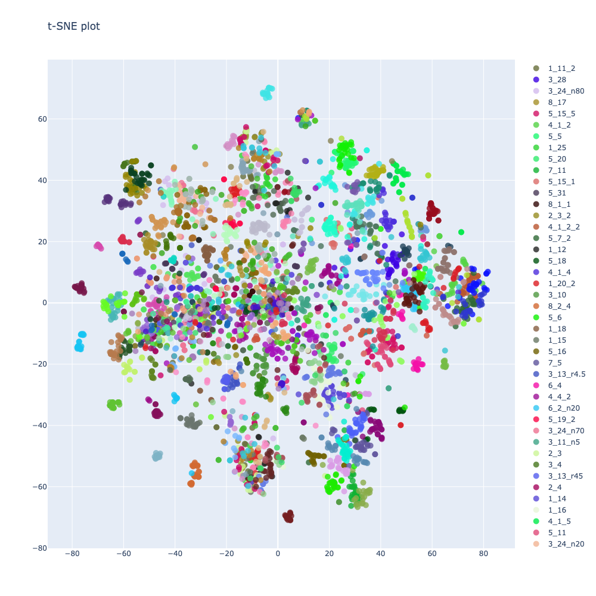

# Siamese and Triplet networks for image classification

This repository contains Keras implementation of a deep neural networks for embeddings learning using Siamese and Triplets approaches with different negative samples mining strategies.

# Installation

```bash
git clone git@github.com:RocketFlash/EmbeddingNet.git
```

## Install dependencies

### Requirements

- tensorflow=2.2.0
- scikit-learn
- opencv
- matplotlib
- plotly - for interactive t-SNE plot visualization
- [albumentations](https://github.com/albu/albumentations) - for online augmentation during training
- [image-classifiers](https://github.com/qubvel/classification_models) - for different backbone models
- [efficientnet](https://github.com/qubvel/efficientnet) - for efficientnet backbones
- [keras-rectified-adam](https://github.com/CyberZHG/keras-radam) - for cool state-of-the-art optimization

Requirements could be installed using the following command:

```bash
$ pip3 install -r requirements.txt
```

# Train

There are two options for training your network: annotations files and data folding

## Annotations files
The simplest way to start training is to generate annotations csv files. Files must contain two columns: file path and class name. For example generate **train.csv** and **val.csv** that will contain two columns "image_id" and "label"

## Data folding
The first option is to split images into folders. In the training dataset, data for training and validation should be in separate folders, in each of which folders with images for each class. Dataset should have the following structure:

```
Dataset
└───train
│   └───class_1
│       │   image1.jpg
│       │   image2.jpg
│       │   ...
│   └───class_2
│       |   image1.jpg
│       │   image2.jpg
│       │   ...
│   └───class_N
│       │   ...
│   
└───val
│   └───class_1
│       │   image1.jpg
│       │   image2.jpg
│       │   ...
│   └───class_2
│       |   image1.jpg
│       │   image2.jpg
│       │   ...
│   └───class_N
│       │   ...
```

For training, it is necessary to create a configuration file in which all network parameters and training parameters will be indicated. Examples of configuration files can be found in the **configs** folder. 

After the configuration file is created, you can run **train.py** file, and start training:

```bash
$ python3 train.py [config (path to configuration_file)]
                   [--resume_from (the checkpoint file to resume from)]
```

# Test

The trained model can be tested using the following command:

```bash
$ python3 test.py [config (path to configuration_file)]
                  [--weights (path to trained model weights file)] 
                  [--encodings (path to trained model encodings file)]
                  [--image (path to image file)]
```

Is is also possible to use [test_network.ipynb](https://github.com/RocketFlash/SiameseNet/blob/master/test_network.ipynb) notebook to test the trained network and visualize input data as well as output encodings.

# Embeddings visualization

Result encodings could be visualized interactively using **plot_tsne_interactive** function in [utils.py](https://github.com/RocketFlash/SiameseNet/blob/master/embedding_net/utils.py).

t-SNE plots of russian traffic sign images embeddings (107 classes)

Before training:


After training:


# References

[1] Schroff, Florian, Dmitry Kalenichenko, and James Philbin. [Facenet: A unified embedding for face recognition and clustering.](https://arxiv.org/abs/1503.03832) CVPR 2015

[2] Alexander Hermans, Lucas Beyer, Bastian Leibe, [In Defense of the Triplet Loss for Person Re-Identification](https://arxiv.org/pdf/1703.07737), 2017

[3] Adam Bielski [Siamese and triplet networks with online pair/triplet mining in PyTorch](https://github.com/adambielski/siamese-triplet)

[4] Olivier Moindrot [Triplet Loss and Online Triplet Mining in TensorFlow](https://omoindrot.github.io/triplet-loss)