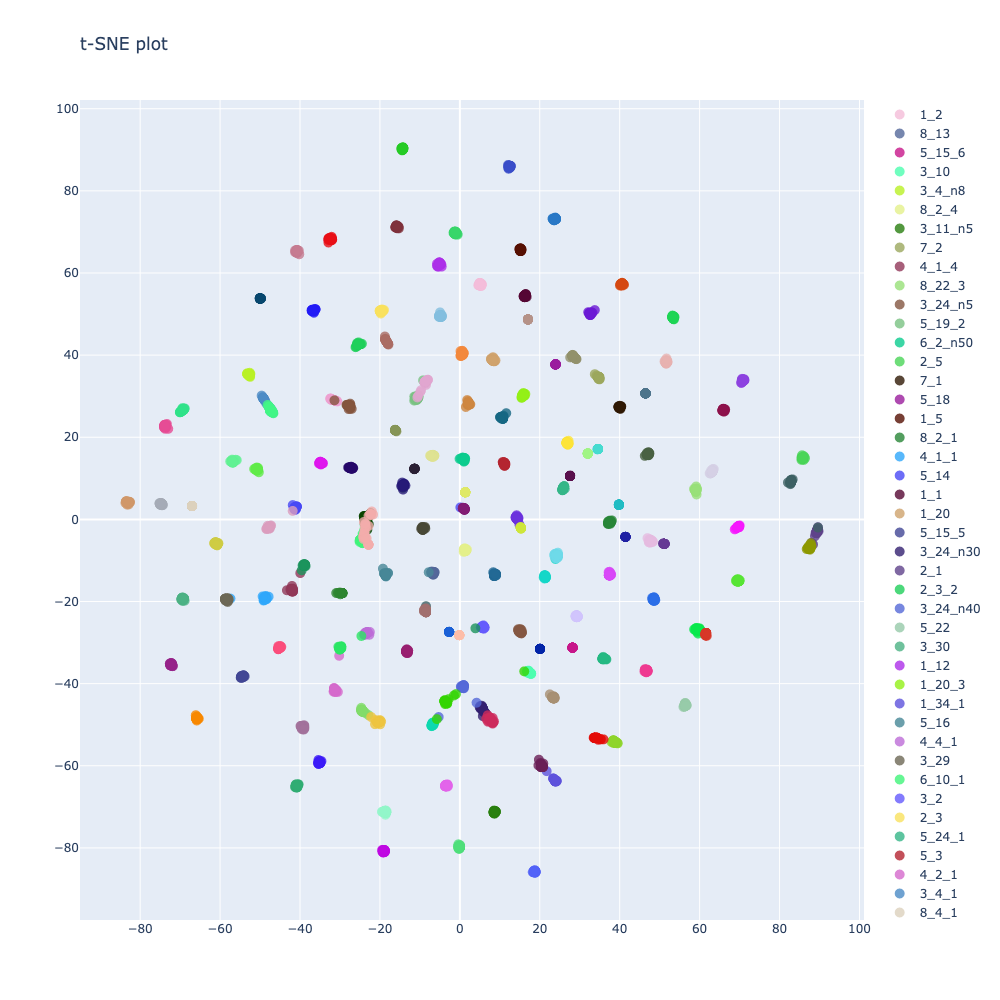

# Siamese and Triplet networks for image classification

This repository contains implementation of a deep neural networks for embeddings learning using Siamese and Triplets approaches with different negative samples mining strategies.

# Installation

```bash
git clone git@github.com:RocketFlash/EmbeddingNet.git
```

## Install dependencies

### Requirements

- keras
- tensorflow
- scikit-learn
- opencv
- matplotlib
- plotly - for interactive t-SNE plot visualization
- [albumentations](https://github.com/albu/albumentations) - for online augmentation during training
- [image-classifiers](https://github.com/qubvel/classification_models) - for different backbone models
- [keras-rectified-adam](https://github.com/CyberZHG/keras-radam) - for cool state-of-the-art optimization

Requirements could be installed using the following command:

```bash
$ pip3 install -r requirements.txt
```

# Train

In the training dataset, the data for training and validation should be in separate folders, in each of which folders with images for each class. Dataset should have the following structure:

```
Dataset
└───train
│   └───class_1
│       │   image1.jpg
│       │   image2.jpg
│       │   ...
│   └───class_2
│       |   image1.jpg
│       │   image2.jpg
│       │   ...
│   └───class_N
│       │   ...
│   
└───val
│   └───class_1
│       │   image1.jpg
│       │   image2.jpg
│       │   ...
│   └───class_2
│       |   image1.jpg
│       │   image2.jpg
│       │   ...
│   └───class_N
│       │   ...
```

For training, it is necessary to create a configuration file in which all network parameters and training parameters will be indicated. Examples of configuration files can be found in the **configs** folder. 

After the configuration file is created, you can modify **train.py** file, and then start training:

```bash
$ python3 train.py
```

# Test

The trained model can be tested using the following command:

```bash
$ python3 test.py [--weights (path to trained model weights file)] 
                  [--encodings (path to trained model encodings file)]
                  [--image (path to image file)]
```

Is is also possible to use [test_network.ipynb](https://github.com/RocketFlash/SiameseNet/blob/master/test_network.ipynb) notebook to test the trained network and visualize input data as well as output encodings.

# Embeddings visualization

Result encodings could be visualized interactively using **plot_tsne_interactive** function in [utils.py](https://github.com/RocketFlash/SiameseNet/blob/master/embedding_net/utils.py).

t-SNE plot of russian traffic sign images embeddings (107 classes):
